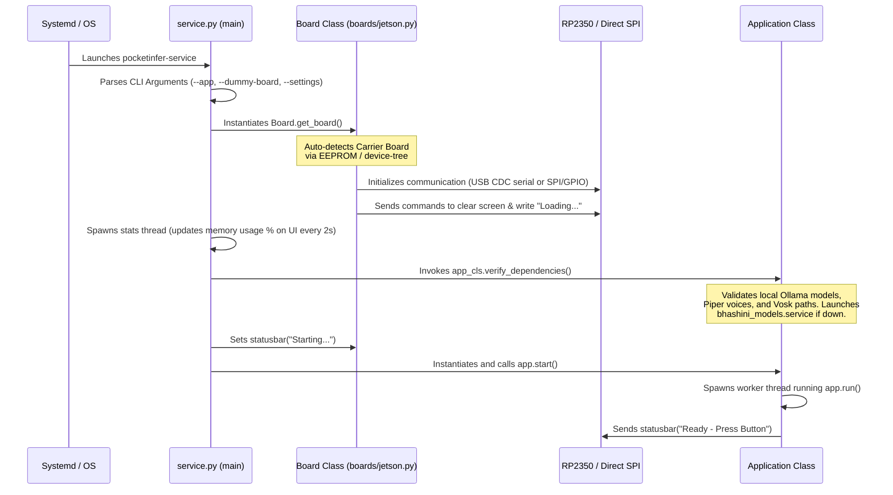
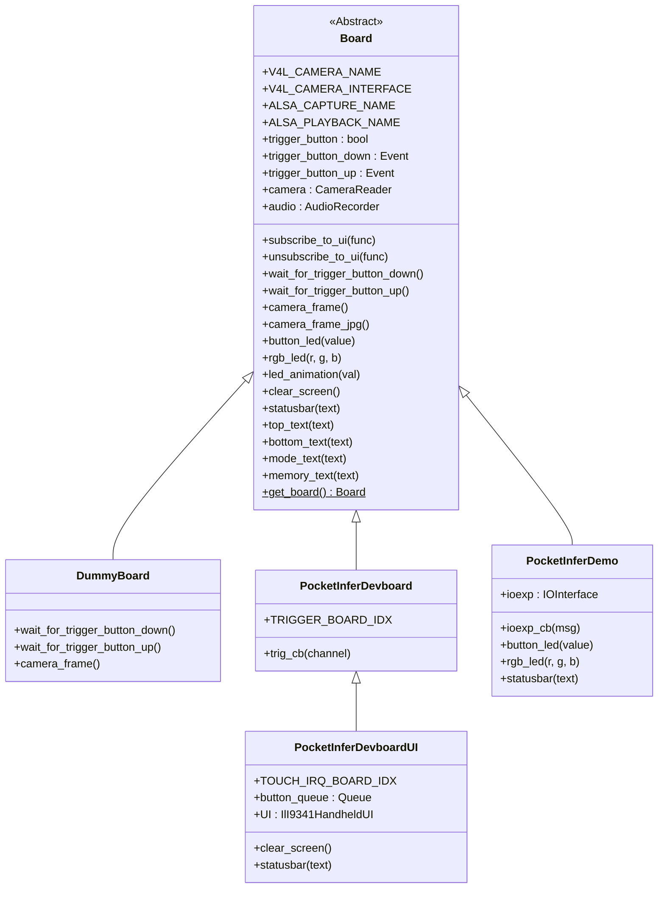
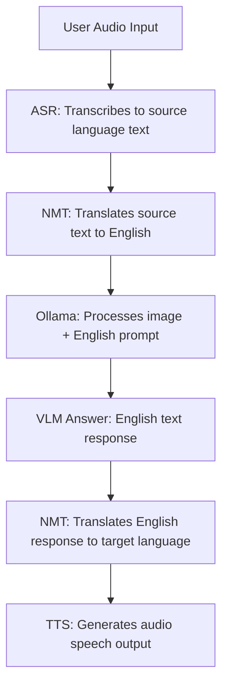
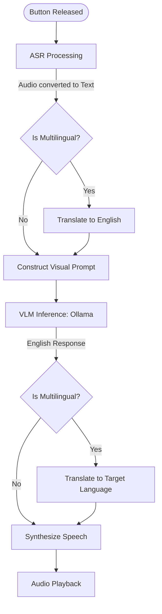
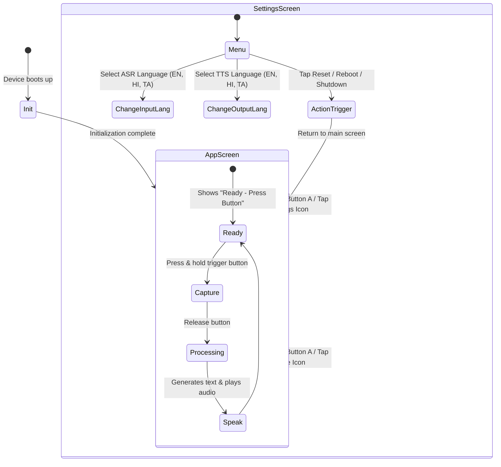
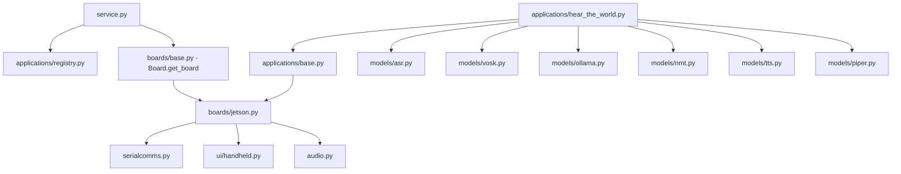
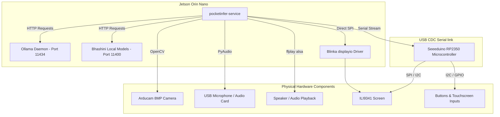

# Suno Sutra Codebase Analysis
**Author:** Senior Embedded AI Software Engineer  
**Date:** August 3, 2026  
**Document Version:** 1.0.0

---

## 1. Overall Architecture

Suno Sutra is an open-source, hardware-software integrated platform for running localized edge AI inference. The architecture is split into a **Hardware Abstraction Layer (HAL)**, an **AI Model Orchestration Engine**, a **Touchscreen User Interface**, and **System Services/Provisioning Scripts**.

The software handles multimodal interactions: it takes real-time visual inputs (camera frames) and audio streams (microphone recordings), processes them through cascaded AI model pipelines (ASR $\rightarrow$ NMT $\rightarrow$ LLM/VLM $\rightarrow$ NMT $\rightarrow$ TTS), and outputs responses visually (TFT Screen) and audibly (Speaker).

### Hardware Configurations
1.  **Suno Sutra Handheld (Demo) Device**: Uses an NVIDIA Jetson Orin Nano 8GB inside a Seeedstudio ReComputer Mini carrier board. Due to GPIO limitations on the carrier, an external **Seeeduino XIAO RP2350 (IO Expander)** connects via USB CDC to manage buttons, NeoPixels, haptics, and the ILI9341 SPI touchscreen display.
2.  **Suno Sutra Development Board**: Directly interfaces hardware triggers and the SPI display/touchscreen to the Jetson Orin Nano header pins using the Blinka compatability layer, avoiding the external RP2350 microcontroller.

---

## 2. Entry Point of the Application

The main entry point for the python application framework is the `pocketinfer-service` CLI command. This command is mapped in `python/setup.py` under `entry_points` to:
*   [python/pocketinfer/service.py](file:///d:/MyData/downloads/suno-sutra-sw-main/suno-sutra-sw-main/python/pocketinfer/service.py) -> `main()`

When the system boots, the systemd unit file [pocketinfer.service](file:///d:/MyData/downloads/suno-sutra-sw-main/suno-sutra-sw-main/python/pocketinfer.service) executes this script as a daemon.

---

## 3. Startup Sequence

When `pocketinfer-service` starts, the execution sequence is as follows:



---

## 4. Folder Structure

```text
suno-sutra-sw-main/
├── .gitattributes
├── .gitignore
├── LICENSE
├── README.md
├── assets/
├── ioexpander/
│   ├── sd/
│   ├── NotoSansDevanagari-Regular-12.pcf
│   ├── NotoSansDevanagari-Regular-14.pcf
│   ├── NotoSansDevanagari-Regular-16.pcf
│   ├── code.py
│   ├── font5x8.bin
│   ├── forkawesome-16.pcf
│   ├── icons.py
│   └── settings.toml
├── python/
│   ├── pocketinfer/
│   │   ├── applications/
│   │   │   ├── __init__.py
│   │   │   ├── base.py
│   │   │   ├── hear_the_world.py
│   │   │   ├── hear_the_world_en.py
│   │   │   └── registry.py
│   │   ├── boards/
│   │   │   ├── base.py
│   │   │   └── jetson.py
│   │   ├── models/
│   │   │   ├── asr.py
│   │   │   ├── nmt.py
│   │   │   ├── ollama.py
│   │   │   ├── piper.py
│   │   │   ├── tts.py
│   │   │   └── vosk.py
│   │   ├── ui/
│   │   │   ├── NotoSansDevanagari-Regular-12.pcf
│   │   │   ├── NotoSansDevanagari-Regular-14.pcf
│   │   │   ├── NotoSansDevanagari-Regular-16.pcf
│   │   │   ├── forkawesome-16.pcf
│   │   │   ├── handheld.py
│   │   │   └── icons.py
│   │   ├── __init__.py
│   │   ├── audio.py
│   │   ├── serialcomms.py
│   │   └── service.py
│   ├── pocketinfer.service
│   ├── requirements.txt
│   └── setup.py
└── rootfs/
    ├── roles/
    │   ├── app/
    │   │   ├── files/
    │   │   └── tasks/
    │   ├── indic/
    │   │   ├── files/
    │   │   └── tasks/
    │   ├── initial/
    │   │   ├── files/
    │   │   └── tasks/
    │   ├── sdk/
    │   │   └── tasks/
    │   └── vllm/
    │       └── tasks/
    ├── Jetson_Flash.md
    ├── README.md
    ├── install_all_usb.yml
    ├── inventory.ini
    └── update_only_usb.yml
```

---

## 5. Purpose of Every Folder

*   **`assets/`**: Visual documentation detailing software and hardware topology, hardware jumper configuration coordinates for flashing, and troubleshooting screenshots.
*   **`ioexpander/`**: Lightweight CircuitPython project that runs on the secondary Seeeduino XIAO RP2350 microcontroller. It abstracts display commands and streams key/touch interactions back to the host Jetson.
*   **`ioexpander/sd/`**: Placeholder mount point for external SD storage.
*   **`python/`**: Top-level directory of the `pocketinfer` Python library containing all hardware controls, wrappers for inference models, and applications.
*   **`python/pocketinfer/`**: Core codebase namespace.
*   **`python/pocketinfer/applications/`**: Concrete app scripts (e.g. English-only or multilingual speech assistants) built on top of the framework.
*   **`python/pocketinfer/boards/`**: Specific target hardware profiles (NVIDIA Jetson, Devboards, headless mock testers).
*   **`python/pocketinfer/models/`**: Sub-package containing adapters to local models (Piper, Vosk) or APIs (Ollama, local Bhashini servers).
*   **`python/pocketinfer/ui/`**: User interface module enabling UI rendering directly on the Jetson's local display SPI interface (without an external RP2350).
*   **`rootfs/`**: Contains the Ansible deployment workspace.
*   **`rootfs/roles/`**: Component-oriented roles targeting specific setup modules (Jetson optimization, Ollama model weights downloading, Bhashini setup).

---

## 6. Purpose of Every Important File

### Root & Metadata Files
*   **[setup.py](file:///d:/MyData/downloads/suno-sutra-sw-main/suno-sutra-sw-main/python/setup.py)**: Configures packaging parameters and maps `pocketinfer-service` CLI commands.
*   **[requirements.txt](file:///d:/MyData/downloads/suno-sutra-sw-main/suno-sutra-sw-main/python/requirements.txt)**: Python package dependency file.
*   **[pocketinfer.service](file:///d:/MyData/downloads/suno-sutra-sw-main/suno-sutra-sw-main/python/pocketinfer.service)**: systemd config file to daemonize `pocketinfer-service`.

### Main Python Core Files
*   **[service.py](file:///d:/MyData/downloads/suno-sutra-sw-main/suno-sutra-sw-main/python/pocketinfer/service.py)**: Parses CLI configuration arguments, instantiates the target `Board`, validates dependencies, and spawns the app thread loop.
*   **[audio.py](file:///d:/MyData/downloads/suno-sutra-sw-main/suno-sutra-sw-main/python/pocketinfer/audio.py)**: Low-level audio recording wrapper (`AudioRecorder`) and playout client (`AudioPlayer`) using ALSA tools.
*   **[serialcomms.py](file:///d:/MyData/downloads/suno-sutra-sw-main/suno-sutra-sw-main/python/pocketinfer/serialcomms.py)**: A serial helper class (`IOInterface`) mapping message patterns (`\r\n` format strings) to and from the external RP2350 board.

### Application Layer
*   **[applications/base.py](file:///d:/MyData/downloads/suno-sutra-sw-main/suno-sutra-sw-main/python/pocketinfer/applications/base.py)**: Implements base execution logic, service availability validation, and model weight pull triggers.
*   **[applications/hear_the_world_en.py](file:///d:/MyData/downloads/suno-sutra-sw-main/suno-sutra-sw-main/python/pocketinfer/applications/hear_the_world_en.py)**: Standard English ASR $\rightarrow$ Ollama VLM $\rightarrow$ Piper TTS loop.
*   **[applications/hear_the_world.py](file:///d:/MyData/downloads/suno-sutra-sw-main/suno-sutra-sw-main/python/pocketinfer/applications/hear_the_world.py)**: Multilingual app using local Bhashini model engines for translation (Hindi/Tamil/English).
*   **[applications/registry.py](file:///d:/MyData/downloads/suno-sutra-sw-main/suno-sutra-sw-main/python/pocketinfer/applications/registry.py)**: Decorator framework supporting registration and metadata inspection of applications.

### Board HAL Layer
*   **[boards/base.py](file:///d:/MyData/downloads/suno-sutra-sw-main/suno-sutra-sw-main/python/pocketinfer/boards/base.py)**: Declares the Virtual Board interface mapping display and button APIs, contains the camera thread worker, and exposes a mock tester (`DummyBoard`).
*   **[boards/jetson.py](file:///d:/MyData/downloads/suno-sutra-sw-main/suno-sutra-sw-main/python/pocketinfer/boards/jetson.py)**: Concrete subclasses for physical NVIDIA boards. Resolves and initializes GPIO configurations and decides whether commands are written directly over SPI/multiprocessing channels or sent to the RP2350 serial link.

### UI Rendering
*   **[ui/handheld.py](file:///d:/MyData/downloads/suno-sutra-sw-main/suno-sutra-sw-main/python/pocketinfer/ui/handheld.py)**: Graphical UI implementation using Blinka displayio compatibility libraries when displays are directly wired to SPI.

### Model Adapters
*   **[models/vosk.py](file:///d:/MyData/downloads/suno-sutra-sw-main/suno-sutra-sw-main/python/pocketinfer/models/vosk.py)**: Helper loading offline Vosk model archives for English ASR.
*   **[models/piper.py](file:///d:/MyData/downloads/suno-sutra-sw-main/suno-sutra-sw-main/python/pocketinfer/models/piper.py)**: Helper loading ONNX English models for local Piper speech synthesis.
*   **[models/ollama.py](file:///d:/MyData/downloads/suno-sutra-sw-main/suno-sutra-sw-main/python/pocketinfer/models/ollama.py)**: Connects to local Ollama inference service (port 11434) for running LLMs/VLMs.
*   **[models/asr.py](file:///d:/MyData/downloads/suno-sutra-sw-main/suno-sutra-sw-main/python/pocketinfer/models/asr.py)** / **[nmt.py](file:///d:/MyData/downloads/suno-sutra-sw-main/suno-sutra-sw-main/python/pocketinfer/models/nmt.py)** / **[tts.py](file:///d:/MyData/downloads/suno-sutra-sw-main/suno-sutra-sw-main/python/pocketinfer/models/tts.py)**: Local REST adapters mapping audio and text queries to local Bhashini model engines (running on port 11400).

### Microcontroller Files
*   **[ioexpander/code.py](file:///d:/MyData/downloads/suno-sutra-sw-main/suno-sutra-sw-main/ioexpander/code.py)**: Main event loop running CircuitPython on the RP2350. Parses incoming commands and pushes tactile button presses and touch panel events to the host.

### Provisioning Scripts
*   **[rootfs/roles/initial/tasks/main.yml](file:///d:/MyData/downloads/suno-sutra-sw-main/suno-sutra-sw-main/rootfs/roles/initial/tasks/main.yml)**: Allocates swap space, disables standard window systems, and configures kernel repositories.
*   **[rootfs/roles/indic/tasks/main.yml](file:///d:/MyData/downloads/suno-sutra-sw-main/suno-sutra-sw-main/rootfs/roles/indic/tasks/main.yml)**: Installs Bhashini local models. Compiles and packages Intel's OpenMP translation engine (`CTranslate2`), compiles `Flite` speech synthesis sources, and installs the `bhashini_models.service` daemon.
*   **[rootfs/roles/vllm/tasks/main.yml](file:///d:/MyData/downloads/suno-sutra-sw-main/suno-sutra-sw-main/rootfs/roles/vllm/tasks/main.yml)**: Installs the Ollama edge engine and pulls visual model weights.
*   **[rootfs/roles/app/tasks/main.yaml](file:///d:/MyData/downloads/suno-sutra-sw-main/suno-sutra-sw-main/rootfs/roles/app/tasks/main.yaml)**: Deploys code, builds python modules, and configures custom DTBO device overlay files on Jetson boot pathways.

---

## 7. Hardware Abstraction Layer (HAL)

The HAL is implemented inside `python/pocketinfer/boards/`. The base class is **`Board`** in `base.py`. 



*   **`Board.get_board()`**: Performs runtime discovery by checking `/proc/device-tree/model` and parsing the i2c EEPROM signatures.
    *   If carrier version matches `699-13768-0000`, it loads `PocketInferDevboardUI` (touchscreen directly wired to the Jetson).
    *   If carrier memory is zeroed out (Seedstudio carrier), it loads `PocketInferDemo` (touchscreen and button controls managed via the external RP2350 over USB).

---

## 8. Audio Pipeline

The audio pipeline captures mic data and plays speech waveforms using the ALSA audio framework.

### Recording (`AudioRecorder` inside `audio.py`)
1.  On initialization, the class tests a range of common sampling frequencies (16kHz, 22.05kHz, 32kHz, 44.1kHz, etc.) against PyAudio formats to select the lowest supported rate.
2.  `start()` spawns a daemon thread reading chunks into a memory buffer (`self.frames`).
3.  `stop()` halts recording and flushes remaining frames.
4.  `to_audio_data()` processes the buffer:
    *   Converts byte buffers into a 16-bit NumPy integer array.
    *   Performs amplitude normalisation: scales the audio based on peak amplitude (`gain = 32768.0 / peak_amplitude`) and scales it up 20% (`* 1.2`) to hard-clip silent recordings.
    *   Returns a speech-recognition `AudioData` wrapper.

### Playback (`AudioPlayer` inside `audio.py`)
1.  Instead of holding audio streams active, `AudioPlayer` spawns an asynchronous `ffplay` subprocess on demand.
2.  Sets environment variables `SDL_AUDIODRIVER=alsa` and `AUDIODEV` to output audio directly to the target ALSA card.
3.  Writes raw 16-bit mono bytes to `stdin` of the `ffplay` subprocess.

---

## 9. ASR (Automatic Speech Recognition) Pipeline

Translates voice waveforms to clean text strings:

*   **English Pipeline**:
    Uses local Kaldi-based **Vosk** models (`vosk-model-small-en-us-0.15`). The application records audio at the target sampling frequency, downsamples/normalizes it to a 16kHz, 16-bit mono format using `AudioData.get_raw_data()`, and feeds the buffer to the local `KaldiRecognizer` engine.
*   **Multilingual Pipeline**:
    The application converts the recorded `.wav` byte array to base64 and executes a `POST` request to the local Bhashini model server's `/asr` endpoint (`http://localhost:11400/asr`).

---

## 10. Translation Pipeline (NMT)

Used by multilingual applications to bridge language barriers. It runs text translation requests on the local CTranslate2 translation server.



The model wrapper class **`Nmt`** handles translation:
*   Submits a request with `src_lang` and `tgt_lang` parameters to `http://localhost:11400/nmt`.
*   Decodes and returns the translated text response.

---

## 11. TTS (Text-to-Speech) Pipeline

Converts output text into spoken audio:

*   **English Pipeline**:
    Uses **Piper Voice** models (`en_US-lessac-medium`). The `Piper` model wrapper loads the ONNX voice model locally. Synthesis runs in a background thread, writing synthesized audio chunks directly to an `AudioPlayer` instance.
*   **Multilingual Pipeline**:
    Submits translation strings to the local Bhashini synthesis server at `http://localhost:11400/tts`. The server returns base64-encoded audio bytes, which are decoded and played through an `AudioPlayer`.

---

## 12. Camera Pipeline

1.  **`CameraReader` Initialization**: Exists in `boards/base.py`. Locates compatible V4L2 devices by matching name patterns (e.g., `Arducam_8mp`) in `/dev/v4l/by-id/*`.
2.  **Capture Loop**: Runs a background daemon thread that queries the camera device using OpenCV (`cv2.VideoCapture`).
3.  **Frame Buffer**: Continuously reads the latest frame into `self.frame` and sets a threading event (`self.frame_available`).
4.  **Encoding**: The application calls `camera_frame_jpg()`, which grabs the latest BGR frame and encodes it to a JPG byte array using `cv2.imencode()`.

---

## 13. Display Pipeline

Renders UI layouts on the 320x240 LCD display. Depending on the hardware configuration, it runs in one of two modes:

### Mode A: Direct SPI (Local)
Used by `PocketInferDevboardUI`:
*   Spawns a separate Python process to run `IlI9341HandheldUI` via Blinka's compatibility layer.
*   Maintains parent-child connection loops using multiprocessing `Pipe` and `Queue` objects to send drawing commands and receive touchscreen press event updates.

### Mode B: External IO Expander (Serial)
Used by `PocketInferDemo`:
*   Sends screen draw commands as formatted text commands (e.g., `TS[text]` for the status bar, `TT[text]` for the top text area, `TB[text]` for the bottom text area) to the RP2350 microcontroller via PySerial.
*   The RP2350 receives these serial commands and renders the text to the display using CircuitPython's `adafruit_display_text` library.

---

## 14. Button Handling

Detects physical button interactions (trigger buttons, navigation buttons, etc.) to drive the application loop.

*   **Direct GPIO Configuration** (`PocketInferDevboard`):
    Tactile buttons are connected directly to the Jetson Orin Nano header pin (`GP167`). The board handles state changes by registering a callback on both rising and falling edges:
    ```python
    GPIO.setup(self.TRIGGER_BOARD_IDX, GPIO.IN)
    GPIO.add_event_detect(self.TRIGGER_BOARD_IDX, GPIO.BOTH, callback=self.trig_cb, bouncetime=100)
    ```
*   **Serial Stream Configuration** (`PocketInferDemo`):
    The external RP2350 microcontroller monitors the trigger button and the 4x1 NeoKey buttons. When a button state changes, the RP2350 sends a serial message to the Jetson (e.g., `BT0` for trigger pressed, `BT1` for trigger released, `BA0/1` for NeoKey state changes).
    The Jetson parses these incoming messages in a serial reader thread and updates internal threading events (`self.trigger_button_down` and `self.trigger_button_up`).

---

## 15. Service Management

Suno Sutra relies on three main systemd service daemons:

```text
┌──────────────────────────────────────────────────────────────────┐
│                      pocketinfer.service                         │
│  Launches main python applications (e.g. pocketinfer-service)    │
└────────────────────────────────┬─────────────────────────────────┘
                                 │ HTTP requests
                                 ▼
┌────────────────────────────────┬─────────────────────────────────┐
│                     bhashini_models.service                      │
│  Hosts ASR, NMT, and TTS models on port 11400 for Indic languages│
└──────────────────────────────────────────────────────────────────┘
                                 │ HTTP requests
                                 ▼
┌────────────────────────────────┬─────────────────────────────────┐
│                         ollama.service                           │
│  Daemon hosting Qwen/Ministral vision models on port 11434       │
└──────────────────────────────────────────────────────────────────┘
```

*   **Service Check**: During app verification, if a model's REST endpoint is unreachable, the wrapper will attempt to start or restart the service using `systemctl restart bhashini_models.service` or `systemctl restart ollama`.

---

## 16. Model Loading

Models are configured using metadata defined in the application's registry decorator.

1.  **Verification**: The application registry checks the configured models on startup:
    *   **Vosk/Piper**: Verifies that local directories exist. If not, it downloads the model files (e.g., Piper `.onnx` and `.json` configs) to the cache directory (`~/.cache/pocketinfer/`).
    *   **Ollama**: Queries the Ollama API to list loaded models. If the requested model is missing, it pulls it using `ollama.pull()`.
2.  **Activation**:
    *   Vosk and Piper models are loaded directly into system RAM.
    *   Ollama vision models are loaded into GPU VRAM by sending a dummy keep-alive request to Ollama's `/api/generate` endpoint on startup.

---

## 17. Model Execution

The application loop runs inference on the visual and audio inputs:



*   **Vosk**: Runs offline speech-to-text on 16kHz audio buffers.
*   **Ollama**: Processes the user's text query alongside the captured JPG image bytes.
*   **Piper**: Synthesizes output speech in real-time, streaming audio chunks to the playback device.

---

## 18. UI Flow

The UI handles two main views: the **Main Application Screen** and the **Settings Screen**.



---

## 19. Application Lifecycle

Applications subclass **`BaseApplication`** and implement the `run()` loop.

1.  **Instantiation**: The application is initialized with the active `Board` and configuration settings.
2.  **Startup (`start()`)**: Runs model verification and downloads missing dependencies. Spawns a background thread running the `_run()` method.
3.  **Run Loop (`run()`)**: A continuous loop that waits for user inputs (button press), processes inputs through the model pipeline, and renders updates to the display.
4.  **Stopping (`stop()`)**: Halts execution, stops active audio streams, and joins the worker thread.

---

## 20. Existing Applications

There are two pre-configured applications:

1.  **`HearTheWorldEn`** (`hear_the_world_en.py`):
    *   **Purpose**: Offline English-only visual assistant.
    *   **Pipeline**: Vosk ASR $\rightarrow$ Ollama VLM (`ministral-3:3B` or `moondream`) $\rightarrow$ Piper TTS.
2.  **`HearTheWorld`** (`hear_the_world.py`):
    *   **Purpose**: Multilingual visual assistant.
    *   **Pipeline**: Vosk/Bhashini ASR $\rightarrow$ Bhashini NMT (to English) $\rightarrow$ Ollama VLM (`qwen3-vl:2b`) $\rightarrow$ Bhashini NMT (to target language) $\rightarrow$ Bhashini TTS. Allows changing settings dynamically via touchscreen menus.

---

## 21. Configuration Files

*   **`python/pocketinfer/applications/hear_the_world.py` (Registry Metadata)**:
    Defines default settings, dependencies, and model parameters:
    ```python
    "default_settings": {
        "input_language": "en",
        "output_language": "en",
    }
    ```
*   **`ioexpander/settings.toml`**: Configure CircuitPython runtime variables.
*   **`rootfs/inventory.ini`**: Defines target host IP addresses and SSH options for deployment.
*   **System overrides**: Can be loaded from external JSON files using the `--settings-file` CLI argument, or set directly via the command line (e.g., `--setting input_language=hi`).

---

## 22. Where New Applications Should Be Added

To add a new application to the platform:
1.  Create your application script in `python/pocketinfer/applications/`.
2.  Define a class that inherits from `BaseApplication` and register it using the `@RegisterApplication` decorator:
    ```python
    from pocketinfer.applications.base import BaseApplication
    from pocketinfer.applications.registry import RegisterApplication

    @RegisterApplication({
        "name": "YourAppName",
        "description": "App description details...",
        "author": "Developer",
        "version": "1.0.0",
        "models": {
             # Add model dependencies here
        }
    })
    class YourApplication(BaseApplication):
        def start(self):
            # Load models and initialize resources
            super().start()

        def run(self):
            # Implement main application loop
    ```
3.  Add the import for your application module to `python/pocketinfer/applications/__init__.py`.

---

## 23. Which Files Should NEVER Be Modified

These files contain core framework and hardware configuration logic. Modifying them can break basic device functionality:
*   **`python/pocketinfer/boards/base.py`**: Changing base interface methods will break class overrides.
*   **`python/pocketinfer/applications/base.py` / `registry.py`**: Changes to the base application class or registry can cause runtime lookup issues.
*   **`python/pocketinfer/serialcomms.py`**: Hardcoded PID/VID values and serial framing parsing rules must match the RP2350 firmware.
*   **`rootfs/roles/initial/tasks/main.yml`**: Contains system configurations specific to the Jetson board. Modifying this can lead to system instability.

---

## 24. Which Files Are Safe to Extend

These files are designed to be extended for new platforms, models, and apps:
*   **`python/pocketinfer/applications/`**: Place your custom application modules here.
*   **`python/pocketinfer/models/`**: Create new model adapters by implementing class methods for `verify()`, `update()`, and `infer()`.
*   **`python/pocketinfer/boards/jetson.py`**: Add support for new carrier boards by creating subclasses of the base `Board` class and updating the `Board.get_board()` factory method to auto-detect them.
*   **`rootfs/roles/`**: Add new Ansible roles to provision models and system dependencies.

---

## 25. Dependency Graph

This diagram shows how different modules within the Python library interact:



---

## 26. Mermaid Architecture Diagrams

### System Runtime Components

Shows the hardware interfaces, background services, and the Python application framework:


