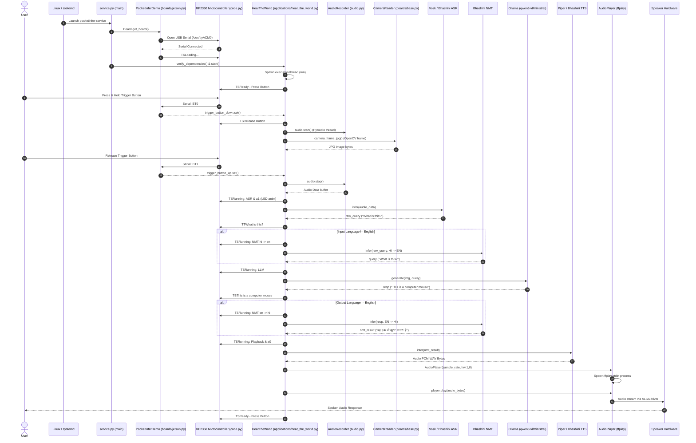

# Suno Sutra Execution Flow & Call Trace
**Author:** Senior Embedded AI Software Engineer  
**Date:** August 3, 2026  
**Document Version:** 1.0.0

---

## 1. High-Level Flow Chart

The following chart outlines the sequential flow of execution from hardware power-on through model inference to speaker audio output.

```mermaid
flowchart TD
    PowerOn([1. Power On]) --> Systemd[2. Systemd launches pocketinfer.service]
    Systemd --> MainEntry[3. Main Entry: service.py main]
    MainEntry --> BoardDetect[4. Board Auto-Detection: Board.get_board]
    BoardDetect --> MicroInit[5. Hardware & Serial Init: PocketInferDemo / IOInterface]
    MicroInit --> AudioInit[6. Audio Subsystem Init: AudioRecorder]
    AudioInit --> ModelCheck[7. Model & Service Verification: verify_dependencies]
    ModelCheck --> AppStart[8. Application Thread Launch: HearTheWorld.start]
    AppStart --> WaitButton[/9. Ready Loop: Wait for Button Press/]
    WaitButton -->|Button Down| RecordStart[10. Start Audio & Camera Capture]
    RecordStart -->|Button Released| RecordStop[11. Stop Audio Capture]
    RecordStop --> ASRProc[12. Speech-to-Text: Vosk / Bhashini ASR]
    ASRProc --> NMTIn{13. Input Lang = EN?}
    NMTIn -->|No| TranslateIn[14. NMT: Source Lang to English]
    NMTIn -->|Yes| VLMProc[15. Vision-Language Model: Ollama]
    TranslateIn --> VLMProc
    VLMProc --> NMTOut{16. Output Lang = EN?}
    NMTOut -->|No| TranslateOut[17. NMT: English to Target Lang]
    NMTOut -->|Yes| TTSProc[18. Text-to-Speech: Piper / Bhashini TTS]
    TranslateOut --> TTSProc
    TTSProc --> PlayAudio[19. Audio Playout: AudioPlayer / ffplay]
    PlayAudio --> SpeakerOut([20. Sound Output via Speaker])
    SpeakerOut --> WaitButton
```



---

## 2. Complete Step-by-Step Call Trace

### Phase 1: Bootstrapping & Service Entry
1. **Power On & Linux Kernel Initialization**: The NVIDIA Jetson Orin Nano boots Ubuntu 22.04 LTS (JetPack 6.2).
2. **Systemd Service Trigger**: The systemd supervisor reads `/etc/systemd/system/pocketinfer.service` and executes:
   ```bash
   /usr/local/bin/pocketinfer-service
   ```
3. **CLI Entry Point (`python/setup.py`)**: Resolves `pocketinfer-service` to:
   * **[python/pocketinfer/service.py](file:///d:/MyData/downloads/suno-sutra-sw-main/suno-sutra-sw-main/python/pocketinfer/service.py)** $\rightarrow$ `main()`

### Phase 2: Hardware Auto-Detection & Initialization
4. **CLI Argument Parsing**: `main()` in `service.py` parses arguments: `--app` (defaults to `"HearTheWorld"`), `--log-level`, `--dummy-board`, and custom `--setting` flags.
5. **Board Factory Execution**: `main()` calls `Board.get_board()` in `python/pocketinfer/boards/base.py`.
   * Reads `/proc/device-tree/model` to verify NVIDIA platform.
   * Reads EEPROM data over i2c bus 0 via `i2ctransfer` to identify the carrier board version.
   * Auto-detects the Seeedstudio carrier board (zeroed EEPROM) and instantiates **`PocketInferDemo(args)`** from `python/pocketinfer/boards/jetson.py`.
6. **Serial Communication Bridge Setup**: Inside `PocketInferDemo.__init__()`:
   * Instantiates `IOInterface()` from `python/pocketinfer/serialcomms.py`.
   * Opens PySerial connection on `/dev/ttyACM0` at 115200 baud to connect to the Seeeduino XIAO RP2350 microcontroller.
   * Spawns a background thread running `IOInterface.reader()` to parse newline-delimited ASCII commands coming from the microcontroller.
   * Subscribes `PocketInferDemo.ioexp_cb` callback to handle incoming microcontroller notifications (`BT0`, `BT1`, `BA...`, `C...`).
   * Sends initial screen reset sequence over serial (`a0`, `TT`, `TB`, `TS `, `TM`, `tm`) and sets initial status text: `self.statusbar("Loading...")` (sends `TSLoading...\n`).

### Phase 3: Audio Subsystem Setup
7. **Audio Device Discovery**: In `Board.__init__()` in `python/pocketinfer/boards/base.py`:
   * Calls `audio.alsa_devices_filtered(record=True, ...)` to query PyAudio input capture cards (selecting e.g. `USB PnP Sound Device`).
   * Calls `audio.alsa_devices_filtered(playback=True, ...)` to select output playback cards (selecting e.g. `USB Audio Device`, formatted as `hw:1,0`).
   * Instantiates `self.audio = audio.AudioRecorder(device_idx=..., frames_per_buffer=4096)`.
   * Invokes `audio.set_volume(alsa_card, 100)` using `amixer` subprocess commands to set Master/Capture volume levels to 100%.
8. **Sample Rate Auto-Selection**: Inside `AudioRecorder.__init__()`:
   * Iterates through candidate sample rates `[16000, 22050, 32000, 44100, 48000, 88200, 96000, 192000]`.
   * Tests each rate against `PyAudio.is_format_supported()`, selecting the lowest supported rate (e.g. 44100 Hz).

### Phase 4: Model & Service Verification
9. **Memory Statistics Polling Thread**: `service.py` spawns a daemon thread running `_update_stats(board)` which polls system memory using `psutil.virtual_memory().percent` every 2 seconds and calls `board.memory_text()`, sending `TmXX%\n` commands to the display.
10. **Application Lookup**: Retrieves application class `app_cls = ApplicationRegistry.get_application("HearTheWorld")`.
11. **Dependency Verification**: `service.py` calls `app_cls.verify_dependencies()`:
    * Reads model configurations declared in `@RegisterApplication`: `ollama`, `piper`, `vosk`, `asr`, `nmt`, `tts`.
    * **`Vosk.verify()` / `Piper.verify()`**: Checks local disk cache `~/.cache/pocketinfer/`. Downloads missing weights using `update()` if required.
    * **`Ollama.verify()`**: Queries Ollama's HTTP API at `http://localhost:11434/api/tags`. If model `qwen3-vl:2b` is missing, executes `ollama.pull()`. Sends a warm-up request with `keep_alive: -1` to load model weights directly into Jetson GPU VRAM.
    * **`Asr.verify()` / `Nmt.verify()` / `Tts.verify()`**: Sends GET requests to the local Bhashini model health endpoint `http://localhost:11400/health`. If connection fails, executes `systemctl restart bhashini_models.service` and polls until healthy.
12. **App Instantiation & Thread Launch**:
    * `service.py` instantiates `app = HearTheWorld(board, settings=settings)`.
    * `HearTheWorld.start()` instantiates model adapter objects (`Piper`, `Vosk`, `Ollama`, `Asr`, `Nmt`, `Tts`) and registers UI button event callbacks.
    * Calls `super().start()` in `applications/base.py`, setting `self.running = True` and spawning a daemon worker thread executing `self.run()`.

### Phase 5: Trigger Event & Audio/Camera Capture
13. **Waiting State**: `HearTheWorld.run()` updates display state `board.statusbar("Ready - Press Button")` and calls `board.wait_for_trigger_button_down()`, blocking on an `Event()` flag.
14. **User Button Press**:
    * User presses physical trigger button on the device.
    * CircuitPython firmware on the RP2350 (`ioexpander/code.py`) detects GPIO pin `D6` pulled low and prints `BT0\n` over the USB serial CDC link.
    * The Jetson serial thread in `serialcomms.py` parses `BT0\n` and triggers callback `PocketInferDemo.ioexp_cb('BT0')`.
    * `ioexp_cb` sets `self.trigger_button_down.set()`, unblocking `wait_for_trigger_button_down()`.
15. **Capture Flow**:
    * Application sets `board.statusbar("Release Button")` and clears display text.
    * Calls `self.piper.stop_playback()` to interrupt any prior audio playing.
    * Calls `self.board.audio.start()`: opens PyAudio input stream and spawns a thread (`_record()`) reading raw PCM buffers into memory array `self.frames`.
    * Calls `img = self.board.camera_frame_jpg()`: fetches OpenCV camera frame from `CameraReader` worker thread and encodes it to a JPEG byte array (`cv2.imencode(".jpg", frame)`).
    * Calls `board.wait_for_trigger_button_up()`.
16. **User Button Release**:
    * User releases trigger button; RP2350 transmits `BT1\n`.
    * Serial callback sets `self.trigger_button_up.set()`, unblocking the thread.
    * Application calls `self.board.audio.stop()`, terminating the recording thread and closing PyAudio streams.

### Phase 6: Speech Recognition (ASR)
17. **Status Update & Visual Animation**: Application calls `board.statusbar("Running: ASR")` and `board.led_animation(1)` (sends `a1\n` to animate RP2350 NeoPixel LEDs).
18. **Audio Data Pre-processing**: Calls `self.board.audio.to_audio_data()`:
    * Converts raw recorded byte buffers into a 16-bit NumPy integer array.
    * Computes peak amplitude and applies dynamic gain normalization: `gain = 32768.0 / peak_amplitude * 1.2`.
    * Clips array values to `[-32768, 32767]` and returns a `speech_recognition.AudioData` object.
19. **ASR Inference Execution**:
    * **If Input Language is English (`'en'`)**: Calls `self.vosk.recognize(audio_data)`. `Vosk` converts audio to 16kHz mono raw bytes, passes it to `KaldiRecognizer.AcceptWaveform()`, and parses recognized text string `raw_query = asr_result['text']`.
    * **If Input Language is Indic (e.g. `'hi'`)**: Calls `self.asr.infer(wav_bytes, "hi")`. `Asr` encodes `.get_wav_data()` as base64 and executes a `POST` request to `http://localhost:11400/asr`.
20. **Query UI Rendering**: Calls `board.top_text(raw_query)` to print the transcribed text query to the top half of the display.

### Phase 7: Translation & VLM Multimodal Inference
21. **Input Neural Machine Translation (NMT)** (if input language $\neq$ `'en'`):
    * Sets statusbar `Running: NMT hi -> en`.
    * Calls `self.nmt.infer(raw_query, "HI", "EN")`, sending a REST payload to `http://localhost:11400/nmt`.
    * Sets English target query variable `query = translated_text`.
22. **Vision-Language Model (VLM) Execution**:
    * Sets statusbar `Running: LLM`.
    * Calls `self.ollama.generate(images=[img], prompt=query + '. Limit response to one short sentence')`.
    * `Ollama` adapter submits a POST request to `http://localhost:11434/api/generate` with the JPEG image bytes and prompt string.
    * Extracts response text `result = resp.response.strip()`.
    * Calls `board.bottom_text(result)` to display the English answer on the lower screen segment.
23. **Output Neural Machine Translation (NMT)** (if output language $\neq$ `'en'`):
    * Sets statusbar `Running: NMT en -> hi`.
    * Calls `self.nmt.infer(result, "EN", "HI")` to translate response back to target language.
    * Sets output text variable `nmt_result = translated_text`.

### Phase 8: Text-to-Speech Synthesis & Audio Playout
24. **Status Update**: Sets `board.statusbar("Running: Playback")` and turns off LED animation (`board.led_animation(0)`).
25. **Speech Synthesis Execution**:
    * **If Output Language is Indic**: Calls `self.tts.infer(nmt_result, output_language)`, sending a POST request to `http://localhost:11400/tts`. Decodes base64 response payload `tts_result_bytes`.
    * **If Output Language is English**: Calls `self.piper.start_playback(result)`. `PiperVoice` synthesizes raw PCM audio buffers in a background thread.
26. **Audio Playout Subprocess**:
    * Opens `tts_result_bytes` using Python's standard `wave.open(BytesIO(tts_result_bytes), 'rb')` to extract frame rate and channel configurations.
    * Instantiates `with AudioPlayer(sample_rate, self.board.alsa_playback_device) as player:`.
    * `AudioPlayer.__enter__()` initializes environment overrides `SDL_AUDIODRIVER=alsa` and `AUDIODEV=hw:1,0` and spawns the `ffplay` command:
      ```bash
      ffplay -nodisp -autoexit -f s16le -ar <rate> -ac 1 -
      ```
    * Calls `player.play(raw_pcm_bytes)` to pipe audio bytes into `ffplay`'s stdin stream.
27. **Speaker Output**: `ffplay` streams digital audio samples directly to ALSA card hardware (`USB Audio Device`), producing physical sound output via the speaker.
28. **Logging & Loop Reset**: Saves JSON performance metrics, camera JPEG images, and WAV audio recordings to `/tmp/hear_the_world_en_logs/`. The application loop resets back to step 13 (`Ready - Press Button`).

---

## 3. End-to-End Sequence Diagram


