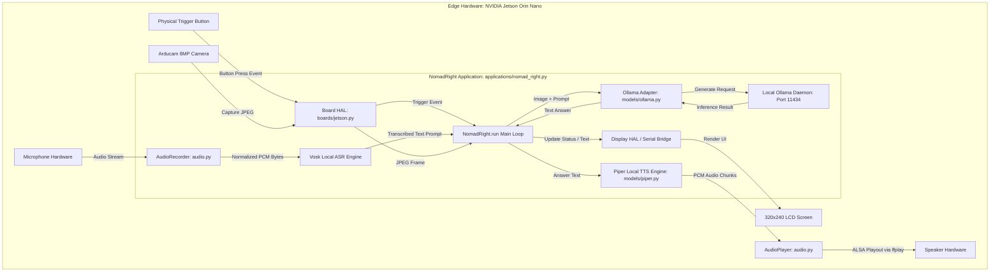

# NomadRight Offline Application Integration Plan
**Author:** Senior Embedded AI Software Engineer  
**Date:** August 3, 2026  
**Document Version:** 1.0.0

---

## 1. Executive Summary

This document details the architectural integration strategy for building **NomadRight**, a 100% offline, edge-native AI application on the Suno Sutra hardware-software platform.

The goal of this analysis is to map out exact integration points across all 12 core subsystems, explicitly categorizing each subsystem under one of four integration decisions:
*   **Reuse As-Is**: Utilize existing modules without code modifications.
*   **Extend**: Add new sub-components, metadata, or configurations without breaking core files.
*   **Replace**: Substitute existing components with custom offline implementations.
*   **Do Not Use**: Omit subsystems unnecessary for the target offline operation.

---

## 2. Subsystem Action Summary Matrix

| Subsystem | Integration Action | Key Target File(s) | Primary Rationale |
| :--- | :--- | :--- | :--- |
| **1. ASR** | **Reuse As-Is** (or **Extend**) | [models/vosk.py](file:///d:/MyData/downloads/suno-sutra-sw-main/suno-sutra-sw-main/python/pocketinfer/models/vosk.py) | Vosk runs 100% offline via local Kaldi models. Extend only if adding new language archives. |
| **2. Translation** | **Do Not Use** (or **Reuse As-Is**) | [models/nmt.py](file:///d:/MyData/downloads/suno-sutra-sw-main/suno-sutra-sw-main/python/pocketinfer/models/nmt.py) | Omit if NomadRight is English-native to reduce latency/memory. Reuse local CTranslate2 if multilingual. |
| **3. TTS** | **Reuse As-Is** (or **Extend**) | [models/piper.py](file:///d:/MyData/downloads/suno-sutra-sw-main/suno-sutra-sw-main/python/pocketinfer/models/piper.py) | Piper synthesizes speech locally offline using ONNX. Extend if adding custom offline voice models. |
| **4. Camera** | **Reuse As-Is** | [boards/base.py](file:///d:/MyData/downloads/suno-sutra-sw-main/suno-sutra-sw-main/python/pocketinfer/boards/base.py) | `CameraReader` thread captures V4L2 frames and encodes JPEG offline without changes. |
| **5. Display** | **Reuse As-Is** | [boards/jetson.py](file:///d:/MyData/downloads/suno-sutra-sw-main/suno-sutra-sw-main/python/pocketinfer/boards/jetson.py), [ui/handheld.py](file:///d:/MyData/downloads/suno-sutra-sw-main/suno-sutra-sw-main/python/pocketinfer/ui/handheld.py) | Renders screen text, status bars, and UI updates locally via RP2350 serial commands or SPI. |
| **6. Buttons** | **Reuse As-Is** | [serialcomms.py](file:///d:/MyData/downloads/suno-sutra-sw-main/suno-sutra-sw-main/python/pocketinfer/serialcomms.py), [boards/jetson.py](file:///d:/MyData/downloads/suno-sutra-sw-main/suno-sutra-sw-main/python/pocketinfer/boards/jetson.py) | Subscribes to trigger events and touchscreen callbacks cleanly via existing board events. |
| **7. Hardware** | **Reuse As-Is** | [boards/base.py](file:///d:/MyData/downloads/suno-sutra-sw-main/suno-sutra-sw-main/python/pocketinfer/boards/base.py), [boards/jetson.py](file:///d:/MyData/downloads/suno-sutra-sw-main/suno-sutra-sw-main/python/pocketinfer/boards/jetson.py) | HAL handles hardware auto-detection (EEPROM), memory stats, and system interfaces. |
| **8. Ollama** | **Reuse As-Is** | [models/ollama.py](file:///d:/MyData/downloads/suno-sutra-sw-main/suno-sutra-sw-main/python/pocketinfer/models/ollama.py) | Runs locally on port 11434. Once weights are cached, runs entirely offline in Jetson VRAM. |
| **9. VLM** | **Extend** | [models/ollama.py](file:///d:/MyData/downloads/suno-sutra-sw-main/suno-sutra-sw-main/python/pocketinfer/models/ollama.py) | Register NomadRight-specific offline GGUF/Ollama model tags in the application metadata. |
| **10. Audio** | **Reuse As-Is** | [audio.py](file:///d:/MyData/downloads/suno-sutra-sw-main/suno-sutra-sw-main/python/pocketinfer/audio.py) | Handles ALSA recording, peak normalisation, gain adjustment, and `ffplay` playout locally. |
| **11. Configuration** | **Extend** | [applications/registry.py](file:///d:/MyData/downloads/suno-sutra-sw-main/suno-sutra-sw-main/python/pocketinfer/applications/registry.py) | Define custom `@RegisterApplication` metadata and settings defaults for NomadRight. |
| **12. Services** | **Reuse As-Is** | [pocketinfer.service](file:///d:/MyData/downloads/suno-sutra-sw-main/suno-sutra-sw-main/python/pocketinfer.service) | Deploy `pocketinfer.service` to auto-launch NomadRight on system boot. |

---

## 3. Subsystem Breakdown & Integration Analysis

### 1. ASR (Automatic Speech Recognition)
*   **Action**: **Reuse As-Is** (or **Extend**)
*   **Target Integration**: [python/pocketinfer/models/vosk.py](file:///d:/MyData/downloads/suno-sutra-sw-main/suno-sutra-sw-main/python/pocketinfer/models/vosk.py)
*   **Analysis**:
    *   Vosk is an offline speech-to-text engine using Kaldi models (`vosk-model-small-en-us-0.15`).
    *   It requires **zero internet access** during operation. Model files reside in local disk storage (`~/.cache/pocketinfer/vosk_model`).
    *   **Integration Strategy**: Reuse `Vosk` as-is for English ASR. If NomadRight requires domain-specific vocabularies or additional offline languages, **Extend** by pre-downloading custom Vosk model zip files to the local model directory.

### 2. Translation (NMT)
*   **Action**: **Do Not Use** (for English-native) / **Reuse As-Is** (for Multilingual)
*   **Target Integration**: [python/pocketinfer/models/nmt.py](file:///d:/MyData/downloads/suno-sutra-sw-main/suno-sutra-sw-main/python/pocketinfer/models/nmt.py)
*   **Analysis**:
    *   If NomadRight operates primarily in a single native language (e.g. English), the Neural Machine Translation layer can be **omitted** (`Do Not Use`). Bypassing NMT saves 200ms–500ms of inference latency and conserves memory.
    *   If NomadRight requires offline multilingual translation, the local CTranslate2 engine (`bhashini_models.service` on port 11400) can be **Reused As-Is** since it runs entirely on local Jetson compute without cloud APIs.

### 3. TTS (Text-to-Speech)
*   **Action**: **Reuse As-Is** (or **Extend**)
*   **Target Integration**: [python/pocketinfer/models/piper.py](file:///d:/MyData/downloads/suno-sutra-sw-main/suno-sutra-sw-main/python/pocketinfer/models/piper.py)
*   **Analysis**:
    *   Piper TTS uses local ONNX models (`en_US-lessac-medium.onnx`) for real-time, low-latency speech synthesis.
    *   Synthesizes speech in a background thread and streams audio bytes to ALSA output devices completely offline.
    *   **Integration Strategy**: Reuse `Piper` as-is for English voice output. **Extend** by downloading additional offline `.onnx` and `.onnx.json` voice models into `~/.cache/pocketinfer/piper_voice/` if alternate voice profiles are desired.

### 4. Camera Subsystem
*   **Action**: **Reuse As-Is**
*   **Target Integration**: [python/pocketinfer/boards/base.py](file:///d:/MyData/downloads/suno-sutra-sw-main/suno-sutra-sw-main/python/pocketinfer/boards/base.py) $\rightarrow$ `CameraReader`
*   **Analysis**:
    *   `CameraReader` executes a continuous background thread capturing V4L2 video streams (`/dev/v4l/by-id/*`) via OpenCV (`cv2.VideoCapture`).
    *   The `board.camera_frame_jpg()` helper encodes frames to JPEG byte arrays in memory on demand.
    *   This pipeline is hardware-accelerated, runs locally, and requires no modification.

### 5. Display Subsystem
*   **Action**: **Reuse As-Is**
*   **Target Integration**: [python/pocketinfer/boards/jetson.py](file:///d:/MyData/downloads/suno-sutra-sw-main/suno-sutra-sw-main/python/pocketinfer/boards/jetson.py), [python/pocketinfer/ui/handheld.py](file:///d:/MyData/downloads/suno-sutra-sw-main/suno-sutra-sw-main/python/pocketinfer/ui/handheld.py)
*   **Analysis**:
    *   The platform provides abstract methods (`statusbar()`, `top_text()`, `bottom_text()`, `mode_text()`, `memory_text()`) that wrap either the USB CDC serial stream (for RP2350 microcontrollers) or local SPI `displayio` processes.
    *   NomadRight can drive status messages, transcribed prompts, and generated responses on the display using these standard board methods without modifying low-level display drivers.

### 6. Button Subsystem
*   **Action**: **Reuse As-Is**
*   **Target Integration**: [python/pocketinfer/serialcomms.py](file:///d:/MyData/downloads/suno-sutra-sw-main/suno-sutra-sw-main/python/pocketinfer/serialcomms.py), [python/pocketinfer/boards/base.py](file:///d:/MyData/downloads/suno-sutra-sw-main/suno-sutra-sw-main/python/pocketinfer/boards/base.py)
*   **Analysis**:
    *   Hardware trigger inputs are handled asynchronously via `board.wait_for_trigger_button_down()` and `board.wait_for_trigger_button_up()`.
    *   UI touch buttons and hardware navigation keys invoke callbacks via `board.subscribe_to_ui(self.ui_cb)`.
    *   NomadRight can subscribe to UI events and await trigger presses without altering the underlying event reader threads.

### 7. Hardware Abstraction Layer (HAL)
*   **Action**: **Reuse As-Is**
*   **Target Integration**: [python/pocketinfer/boards/base.py](file:///d:/MyData/downloads/suno-sutra-sw-main/suno-sutra-sw-main/python/pocketinfer/boards/base.py), [python/pocketinfer/boards/jetson.py](file:///d:/MyData/downloads/suno-sutra-sw-main/suno-sutra-sw-main/python/pocketinfer/boards/jetson.py)
*   **Analysis**:
    *   `Board.get_board()` performs auto-detection of NVIDIA Jetson modules and carrier board EEPROMs.
    *   It manages local ALSA audio cards, volume controls, camera reader threads, and memory tracking.
    *   NomadRight will receive the active `Board` instance during application initialization.

### 8. Ollama Subsystem
*   **Action**: **Reuse As-Is**
*   **Target Integration**: [python/pocketinfer/models/ollama.py](file:///d:/MyData/downloads/suno-sutra-sw-main/suno-sutra-sw-main/python/pocketinfer/models/ollama.py)
*   **Analysis**:
    *   Ollama runs as a local daemon service on port 11434 (`http://localhost:11434`).
    *   The `Ollama` adapter class provides Python bindings for `generate()` and `chat()`.
    *   Once model weights are downloaded to local storage, Ollama performs inference entirely offline in Jetson VRAM.

### 9. VLM (Vision-Language Model)
*   **Action**: **Extend**
*   **Target Integration**: Application Metadata in `python/pocketinfer/applications/`
*   **Analysis**:
    *   NomadRight will require a specific offline Vision-Language Model (e.g. `ministral-3:3B`, `qwen3-vl:2b`, or a domain-specific fine-tuned GGUF model).
    *   **Integration Strategy**: **Extend** by specifying the target model tag inside NomadRight's application metadata block (`"models": {"ollama": {"model_name": "nomadright-vlm:3b"}}`).
    *   During deployment, pre-pull the model weights to the local Ollama storage directory so no network requests occur at runtime.

### 10. Audio Subsystem
*   **Action**: **Reuse As-Is**
*   **Target Integration**: [python/pocketinfer/audio.py](file:///d:/MyData/downloads/suno-sutra-sw-main/suno-sutra-sw-main/python/pocketinfer/audio.py)
*   **Analysis**:
    *   `AudioRecorder` captures mono audio, auto-selects sampling rates, applies peak normalization, and scales gain.
    *   `AudioPlayer` manages `ffplay` subprocess playout directly to target ALSA audio devices.
    *   Functions completely offline with no external service or internet requirements.

### 11. Configuration Subsystem
*   **Action**: **Extend**
*   **Target Integration**: [python/pocketinfer/applications/registry.py](file:///d:/MyData/downloads/suno-sutra-sw-main/suno-sutra-sw-main/python/pocketinfer/applications/registry.py)
*   **Analysis**:
    *   Create a new application module `python/pocketinfer/applications/nomad_right.py`.
    *   Decorate the class with `@RegisterApplication` specifying metadata, required models, service dependencies, and default settings:
        ```python
        @RegisterApplication({
            "name": "NomadRight",
            "description": "Offline domain-specific AI assistant for field operations.",
            "author": "Developer",
            "version": "1.0.0",
            "models": {
                "ollama": {"model_name": "ministral-3:3B"},
                "piper": {"voice_name": "en_US-lessac-medium"},
                "vosk": {"model_name": "vosk-model-small-en-us-0.15"},
            },
            "default_settings": {
                "mode": "field_analysis",
            },
            "service_dependencies": ["ollama"],
        })
        ```
    *   Expose application imports in `python/pocketinfer/applications/__init__.py`.

### 12. Services Subsystem
*   **Action**: **Reuse As-Is**
*   **Target Integration**: [python/pocketinfer.service](file:///d:/MyData/downloads/suno-sutra-sw-main/suno-sutra-sw-main/python/pocketinfer.service)
*   **Analysis**:
    *   The `pocketinfer.service` systemd unit automatically executes `pocketinfer-service` at boot.
    *   NomadRight can be designated as the default application by setting the CLI default or passing `--app NomadRight` in the service startup flags.

---

## 4. Architecture & Data Flow Diagram for NomadRight



---

## 5. Offline Deployment & Pre-provisioning Checklist

To guarantee 100% offline execution of **NomadRight**, perform the following provisioning steps prior to field deployment:

1.  **Ollama Model Cache Pre-loading**:
    Pre-pull all required Ollama models while connected to staging networks:
    ```bash
    ollama pull ministral-3:3B
    ollama pull qwen3-vl:2b
    ```
    Verify weights exist in local storage (`/usr/share/ollama/.ollama/models` or `~/.ollama/models`).

2.  **Vosk ASR Model Caching**:
    Pre-download the offline Vosk speech recognition archives to the local cache directory:
    ```bash
    mkdir -p ~/.cache/pocketinfer/vosk_model
    # Extract vosk-model-small-en-us-0.15 into ~/.cache/pocketinfer/vosk_model/
    ```

3.  **Piper TTS Voice Caching**:
    Pre-download ONNX voice files and JSON configurations:
    ```bash
    mkdir -p ~/.cache/pocketinfer/piper_voice
    # Download en_US-lessac-medium.onnx & en_US-lessac-medium.onnx.json into ~/.cache/pocketinfer/piper_voice/
    ```

4.  **Systemd Service Verification**:
    Ensure `pocketinfer.service` and `ollama.service` are enabled for automatic boot:
    ```bash
    sudo systemctl enable ollama
    sudo systemctl enable pocketinfer
    ```

5.  **Offline Verification Command**:
    Test offline startup without internet connectivity:
    ```bash
    pocketinfer-service --app NomadRight --log-level DEBUG
    ```
