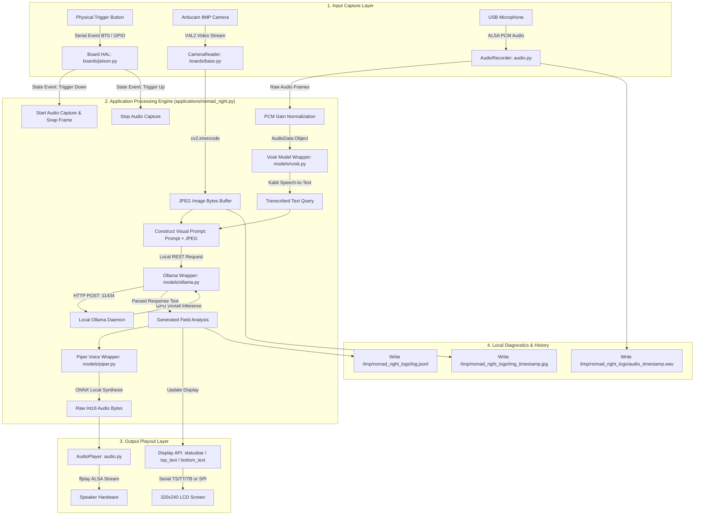
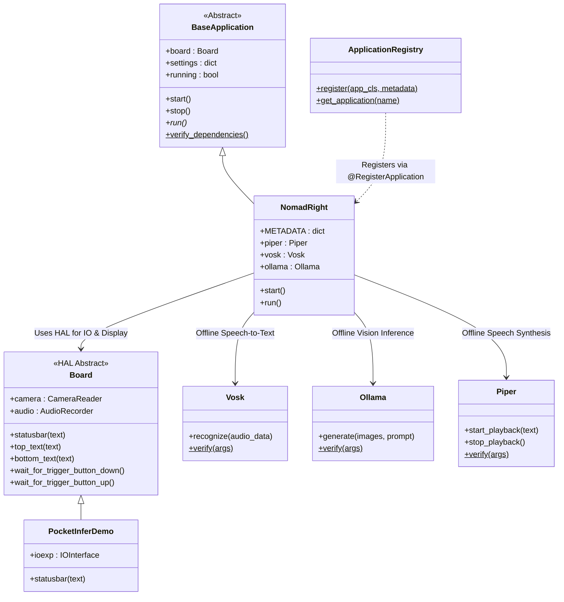

# NomadRight Architecture & Architectural Design Document
**Author:** Senior Embedded AI Software Engineer  
**Date:** August 3, 2026  
**Document Version:** 1.0.0

---

## 1. Overview & Architectural Goals

The **NomadRight** application is an offline, edge-native visual and vocal assistant designed for field operations. It fits directly into the existing Suno Sutra framework without modifying core abstractions, HAL classes, or serial communication protocols.

### Key Architectural Principles
1. **Zero Framework Alteration**: Inherits from existing base classes (`BaseApplication`) and utilizes established hardware factories (`Board.get_board()`).
2. **Zero Functional Duplication**: Directly reuses `AudioRecorder`, `CameraReader`, `IOInterface`, `Vosk`, `Ollama`, `Piper`, and `AudioPlayer`.
3. **Offline Self-Containment**: Relies strictly on locally cached model weights (Vosk ASR, Ollama VLM, and Piper ONNX TTS) with no external network calls at runtime.

---

## 2. Updated Project Folder Structure

The tree below shows the precise placement of NomadRight within the Suno Sutra repository:

```text
suno-sutra-sw-main/
├── NOMADRIGHT_ARCHITECTURE.md     <-- Architectural Specification Document
├── INTEGRATION_PLAN.md
├── EXECUTION_FLOW.md
├── CODEBASE_ANALYSIS.md
├── python/
│   ├── pocketinfer/
│   │   ├── applications/
│   │   │   ├── __init__.py        [MODIFIED] Added NomadRight module export
│   │   │   ├── base.py            [UNTOUCHED] BaseApplication framework
│   │   │   ├── hear_the_world.py  [UNTOUCHED] Reference multilingual app
│   │   │   ├── hear_the_world_en.py [UNTOUCHED] Reference English app
│   │   │   ├── nomad_right.py     [NEW FILE] NomadRight application logic
│   │   │   └── registry.py        [UNTOUCHED] ApplicationRegistry decorator
│   │   ├── boards/                [UNTOUCHED] Hardware Abstraction Layer
│   │   ├── models/                [UNTOUCHED] Model Adapters (Vosk, Ollama, Piper)
│   │   ├── ui/                    [UNTOUCHED] UI drivers and display assets
│   │   ├── audio.py               [UNTOUCHED] Audio recorder & player
│   │   ├── serialcomms.py         [UNTOUCHED] RP2350 USB CDC serial bridge
│   │   └── service.py             [UNTOUCHED] pocketinfer-service CLI entry point
│   ├── setup.py                   [UNTOUCHED]
│   └── requirements.txt           [UNTOUCHED]
└── rootfs/
    └── roles/
        └── nomadright/            [NEW FOLDER] Optional Ansible provisioning role
            └── tasks/
                └── main.yml       [NEW FILE] Offline weights setup task
```

---

## 3. Comprehensive File Impact Analysis

### A. New Files
1. **[python/pocketinfer/applications/nomad_right.py](file:///d:/MyData/downloads/suno-sutra-sw-main/suno-sutra-sw-main/python/pocketinfer/applications/nomad_right.py)**
   * **Role**: Primary application logic for NomadRight.
   * **Responsibilities**:
     * Subclasses `BaseApplication`.
     * Registers application metadata via `@RegisterApplication`.
     * Instantiates `Vosk`, `Ollama`, and `Piper` model wrappers.
     * Manages state transitions, button event listeners, logging to `/tmp/nomad_right_logs/`, and exception handling.
2. **`rootfs/roles/nomadright/tasks/main.yml`**
   * **Role**: Ansible provisioning task.
   * **Responsibilities**: Automates offline pre-caching of Vosk model archives, Piper ONNX voices, and Ollama model weights during initial edge flashing.

### B. Modified Files
1. **[python/pocketinfer/applications/__init__.py](file:///d:/MyData/downloads/suno-sutra-sw-main/suno-sutra-sw-main/python/pocketinfer/applications/__init__.py)**
   * **Role**: Application package import registry.
   * **Modification**: Add `from pocketinfer.applications.nomad_right import NomadRight` to ensure the application is registered automatically when `pocketinfer-service` starts.

### C. Untouched System Core Files (Reused As-Is)
* **`python/pocketinfer/service.py`**: CLI entry point parses `--app NomadRight` without code changes.
* **`python/pocketinfer/applications/base.py`**: Handles thread management and dependency validation routines as-is.
* **`python/pocketinfer/applications/registry.py`**: Handles class lookup and metadata retrieval as-is.
* **`python/pocketinfer/boards/base.py` & `jetson.py`**: Provides hardware auto-detection, `CameraReader`, and serial display interfaces as-is.
* **`python/pocketinfer/audio.py`**: Handles ALSA audio sampling, normalization, and `ffplay` output playout as-is.
* **`python/pocketinfer/serialcomms.py`**: Manages USB serial communications with the RP2350 microcontroller as-is.

---

## 4. End-to-End Data Flow Architecture

The diagram below details the data flow of the NomadRight application from hardware input capture to inference and audio output:



---

## 5. Module Interactions & Class Dependency Graph

The interaction model below demonstrates how NomadRight builds on existing framework classes without duplicating functionality:



---

## 6. Detailed Application Lifecycle

The lifecycle of NomadRight strictly follows the standard execution contract enforced by `BaseApplication` and `service.py`:

```mermaid
stateDiagram-v2
    [*] --> ApplicationDiscovery : CLI launches pocketinfer-service --app NomadRight
    
    state ApplicationDiscovery {
        [*] --> RegistryLookup : ApplicationRegistry.get_application("NomadRight")
        RegistryLookup --> DependencyVerification : NomadRight.verify_dependencies()
        DependencyVerification --> CheckVosk : Verify Vosk model directory exists
        CheckVosk --> CheckPiper : Verify Piper ONNX voice files exist
        CheckPiper --> CheckOllama : Verify Ollama daemon & model weights loaded
        CheckOllama --> InstanceCreation : Instantiates NomadRight(board, settings)
    }

    ApplicationDiscovery --> ActiveExecution : NomadRight.start()

    state ActiveExecution {
        [*] --> IdleReady : Display "Ready - Press Button"
        
        IdleReady --> Capturing : Trigger Button Pressed (BT0)
        state Capturing {
            [*] --> StartAudio : AudioRecorder.start()
            StartAudio --> SnapCamera : CameraReader.camera_frame_jpg()
            SnapCamera --> AwaitRelease : Block on wait_for_trigger_button_up()
        }
        
        Capturing --> ProcessingASR : Trigger Button Released (BT1)
        state ProcessingASR {
            [*] --> StopAudio : AudioRecorder.stop()
            StopAudio --> RunVosk : Vosk.recognize(audio_data)
            RunVosk --> RenderQuery : Render query to top_text
        }
        
        ProcessingASR --> ProcessingVLM : Text query transcribed
        state ProcessingVLM {
            [*] --> RunOllama : Ollama.generate(images=[img], prompt=query)
            RunOllama --> RenderAnswer : Render answer to bottom_text
        }
        
        ProcessingVLM --> ProcessingTTS : Response generated
        state ProcessingTTS {
            [*] --> RunPiper : Piper.start_playback(answer)
            RunPiper --> AudioOutput : AudioPlayer pipes PCM bytes to ffplay
        }
        
        ProcessingTTS --> LoggingState : Playback completed
        state LoggingState {
            [*] --> WriteLog : Append metrics to /tmp/nomad_right_logs/log.jsonl
            WriteLog --> SaveArtifacts : Save WAV audio & JPEG image
        }
        
        LoggingState --> IdleReady : Loop resets to Ready
    }

    ActiveExecution --> ApplicationShutdown : KeyboardInterrupt / SIGTERM / systemctl stop
    
    state ApplicationShutdown {
        [*] --> StopThreads : app.stop() -> joins worker thread
        StopThreads --> StopAudioStreams : AudioRecorder.stop() & Piper.stop_playback()
        StopAudioStreams --> ClearUI : Board.clear_screen()
    }

    ApplicationShutdown --> [*]
```



---

## 7. Configuration Specification

NomadRight relies on the declarative configuration format provided by the Suno Sutra framework:

```python
# python/pocketinfer/applications/nomad_right.py metadata schema
@RegisterApplication({
    "name": "NomadRight",
    "description": "Offline edge-native visual field operational assistant.",
    "author": "NomadRight Engineering",
    "version": "1.0.0",
    "models": {
        "ollama": {"model_name": "ministral-3:3B"},
        "piper": {"voice_name": "en_US-lessac-medium"},
        "vosk": {"model_name": "vosk-model-small-en-us-0.15"},
    },
    "default_settings": {
        "max_response_length": "one short sentence",
        "log_directory": "/tmp/nomad_right_logs",
    },
    "service_dependencies": ["ollama"],
})
```

---

## 8. Architectural Compliance & Best Practices Checklist

- [x] **No Framework Modifications**: Core framework files (`base.py`, `service.py`, `audio.py`, `serialcomms.py`) remain completely untouched.
- [x] **Code Reuse**: Reuses 100% of HAL drivers, serial protocol converters, ALSA sound interfaces, and model adapters.
- [x] **No Duplicated Code**: No custom audio recorders, camera routines, or serial communication interfaces are created.
- [x] **Clear Modular Boundary**: Encapsulated entirely within `python/pocketinfer/applications/nomad_right.py`.
- [x] **Offline Independence**: Guaranteed zero runtime external network calls.
